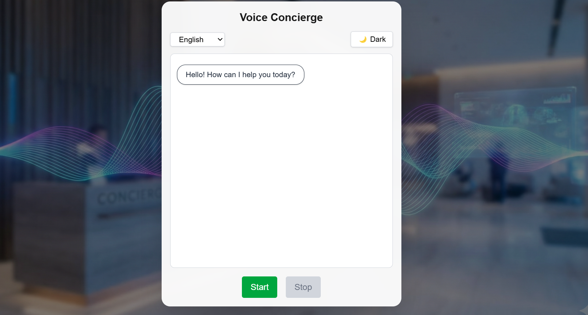
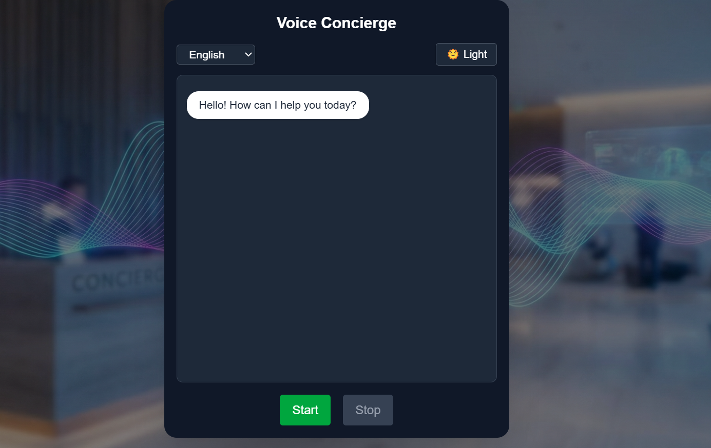
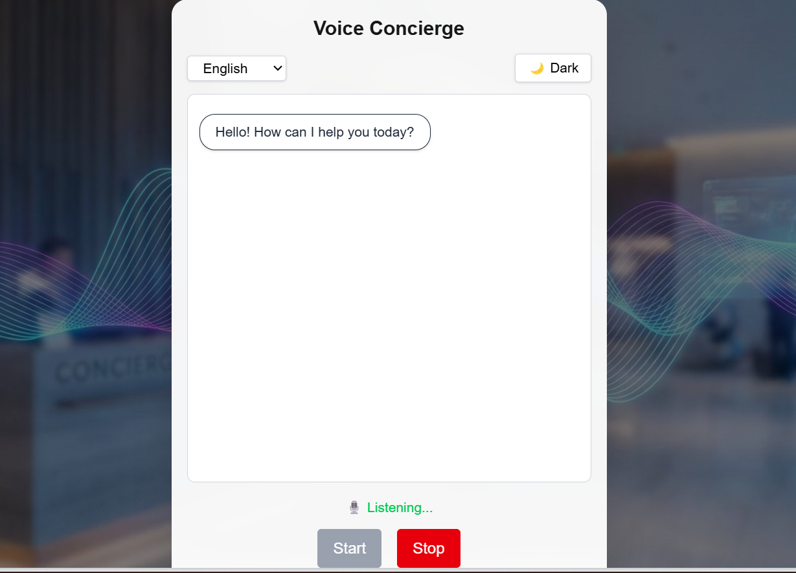

🎙️ Voice Concierge Web App

A browser-based Voice Concierge web application that allows hotel guests to speak queries, receive rule-based responses, hear spoken replies, and view the full conversation history in a clean chat UI.

The application runs fully in the browser, without using any paid APIs, backend services, or AI models.

🌐 Live Demo 

🔗 Live URL: voice-concierge-pavankumarps.vercel.app

📦 GitHub Repo: https://github.com/Pavankumarpsp/voice-concierge

## 🖼️ Screenshots

### 🌞 Light Mode

---

### 🌙 Dark Mode

---

### 💬 Chat Conversation

---

### 🎙️ Listening State

🛠️ Tech Stack

Framework: Next.js (App Router)

Language: TypeScript

Styling: Tailwind CSS

Speech-to-Text: Web Speech API (Browser-native)

Text-to-Speech: Web Speech API (Browser-native)

State Management: React Hooks

Deployment: Vercel

▶️ How to Run the Project Locally

1️⃣ Clone the repository
git clone <your-repo-url>
cd voice-concierge

2️⃣ Install dependencies
npm install

3️⃣ Start development server
npm run dev

4️⃣ Open in browser
http://localhost:3000

**Note: Microphone access is required for speech input.**

**Note: While speech recognition supports multiple languages, responses are generated only when
matching keywords are defined. Unmatched non-English queries correctly fall back by design.**

🎯 Project Features

✅ Speech-to-Text (STT)

Uses the browser’s Web Speech API

Captures user voice input

Supports multiple languages (English, Hindi, Kannada)

✅ Rule-Based Responses

Matches user queries against predefined keywords

Returns canned responses based on hotel services

Provides a fallback message for unmatched queries

✅ Text-to-Speech (TTS)

Uses browser-native speech synthesis

Reads assistant responses aloud

Displays speaking status indicator

✅ Chat Interface

Displays full conversation history

Auto-scrolls as new messages are added

Clear distinction between user and assistant messages

      

**🔍 How Queries Are Matched (Keywords / Fuzzy Logic)**

User queries are processed using a keyword-based matching approach:

Input text is converted to lowercase

Special characters (e.g., “Wi-Fi”) are normalized

Keywords are checked using includes() logic

First matching rule returns its response

If no match is found, a fallback message is returned

Example Rule
{
  keywords: ["wifi", "internet"],
  response: "The WiFi password is: ROOM1234."
}

**This approach keeps the system:**

Simple

Deterministic

Fully offline

Easy to extend

🌟 **Bonus Features Added (Optional)**

🌍 Multi-language speech input (English, Hindi, Kannada)

🌙 Dark / Light mode toggle

✨ Glassmorphism UI design

🔊 Speaking & Listening indicators

📜 Auto-scrolling chat window

🚫 Prevention of STT–TTS feedback loop
